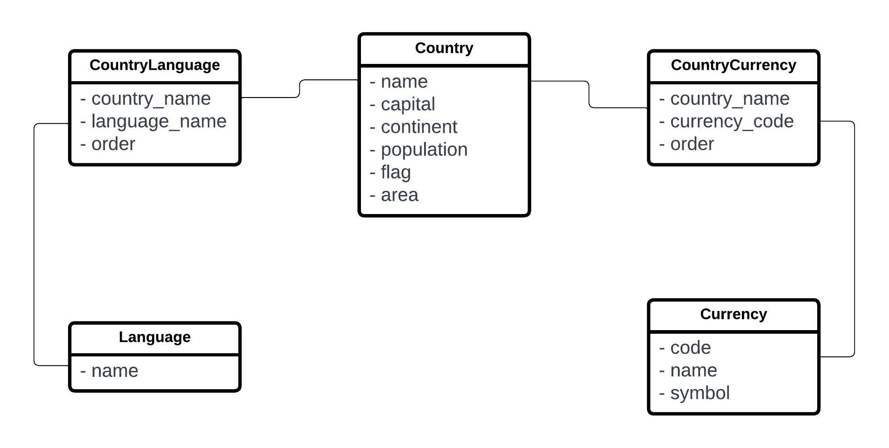

# Challenge_Backend

## Requisitos

- python 3
- instalar sqlalchemy con el comando `pip install SQLAlchemy`.
- instalar request: `pip install requests`
- instalar xlsxwriter: `pip install xlsxwriter`
- instalar xlsxwriter: `pip install seaborn`

## Ejecución

Para simular en envio de mails se eligió usar un servidor smtpd local para no tener que insertar claves o API keys al programa. Se puede con el siguiente commando:

```
python -m smtpd -c DebuggingServer -n localhost:1025
```

De no correr esto simplemente se generará el excel y el mail no se enviará, imprimiendo un error por pantalla.

Para ejecutar el programa simplemente ejecutar el comando:
```
python3 main.py
```

Si se quere ver el excel resultante, acceder al archivo `challenge.xlsx` que se genero en la carpeta donde se ejecutó el programa.

## Esquema de la base de datos

En los datos un pais podia tener muchas lenguas y monedas. También esas lenguas y monedas podían estar en muchos paises por lo que se optó por la siguiente estructura en la base de datos que permite la mayor flexibilidad respecto a éstos.



Adicionalmente se asumió que el orden de aparición de estos datos representaba un órden por lo que si un lenguaje aparecía primero éste era el lenguaje principal del país por lo que se agrego ese campo a la base de datos.